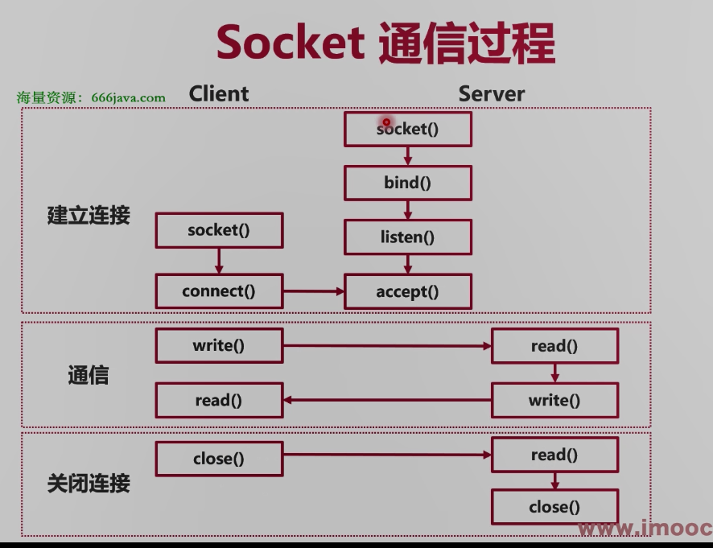

### TCP的通信过程

1.先通过三次握手建立连接

​	1.客服端向server端发送一个连接请求

​	2.sever端向客服端发送一个确定连接请求和一个连接请求

​	3.客服端向server端发送一个确定连接请求

2.数据传输

3.通过四次挥手断开连接

​	1.client端向server端发起一个断开请求

​	2.sever端回应客服端发送一个确认断开请求

​	3.sever端在内部数据处理完成后向client端发送一个断开请求

​	4.client端向server端发送一个确认断开请求

### Socket 屏蔽了底层的握手和挥手

1.Socket作为TCP网络连接的抽象

2.linux中Socket以文件描述符FD作为标识

### 阻塞IO

**介绍:阻塞 I/O 是同步的，意味着应用程序会被阻塞，直到 I/O 操作完成。这意味着程序的执行将受到 I/O 操作的速度限制。**

1.同步读写Socket，线程陷入内核态，一个线程负责一个客服端

2.当读写成功后，切换回用户态，继续执行阻塞的socket

3.优点:开发难度小，代码简单

4.缺点:内核态切换开销大 

### 非阻塞IO

**介绍:使用非阻塞 I/O 操作，应用程序可以轮询检查是否有数据就绪，而不会被阻塞。这可以通过设置文件描述符为非阻塞模式来实现。非阻塞 I/O 结合轮询或事件循环可以提高并发性能。**

1.如果暂时无法收发数据,会返回错误，一个线程负责多个客服端

2.应用回不断轮询，知道Socket可以读写

3.优点:不会陷入内核态，自由度高

4.缺点:需要自旋轮询

### 多路复用 Linux epoll 

**介绍:多路复用技术（如 `select`、`poll`、`epoll` 等）来监视多个文件描述符的状态，以确定哪些文件描述符可以进行 I/O 操作，从而避免阻塞。**

1.注册多个Socket事件

2.调用epool，当有事件发生，返回Socket

3.优点:提供事件列表，不需要查询各个Scoket

4.缺点:开发难点大，逻辑复杂

### Go是如何抽象Epoll的

#### 阻塞模型+多路复用

1.在底层使用操作系统的多路复用IO

2.在协程层次使用阻塞io模型

#### netpollinit()新建多路复用器

1.新建Epoll

2.新建一个pipe管道用于中断Epoll

3.将管道有数据到达事件注册到Epoll中

#### netpollopen()插入事件

1.传入一个Socket的FD，和pollDesc指针

2.pollDesc指针是Socket相关详细信息

3.pollDesc中记录了哪个协程休眠在等待次Socket

4.将Socket可读，可写，断开事件注册到Epoll中

#### netpoll()查询发生了什么事件

1.调用epoll_wait(),查询有哪些事件发生

2.根据Socket相关的pollDesc信息，返回哪些协程路唤醒

#### Go将多路复用器的操作进行了抽象和适配

1.将新建多路复用器抽象为了netpollinit()

2.将插入监听事件抽象为了netpollopen()

3.将查询事件抽象为了netpoll()

4.但不是返回事件，而是返回等待事件的协程列表

#### pollcache 和 pollDesc

1.pollcache:一个带锁的链表，作为链表头

2.pollDesc：链表的成员

3.pollDesc是runtime包对Socket的详细描述

4.rg，wg：1，或2，或等待协程G的地址

#### Network poller 新增监听Socket

1.poll_runtime_pollOpen()

2.在pollcache链表中分配一个pollDesc

3.初始化pollDesc(rg,wg为0)

4.调用netpollopen()

#### 场景1：socket已经可读写

1.runtime循环调用netpoll()方法（g0协程）

2.发现Socket可读写时,给对应的rg或者wg置为pdReady

3.协程调用poll_runtime_pollWait()

4.判断rg或者wg已经置为pdReady(1),返回0

#### 场景2: socket不可读写

1.runtime循环调用netpoll()方法（g0协程）

2.发现Socket可读写时,给对应的rg或者wg置为pdReady

3.若为协程地址，返回协程地址

4.调度器开始调度对应协程

#### 总结

1.Network poller是runtime的强大功夫就

2.抽象了多路复用器的操作

3.Network Poller可以自动监测多个Socket状态

4.在Socket状态可用时，快速返回成功

5.在Socket状态不可用时，休眠等待

### Go是如何抽象Socket的

#### net.Listen()

1.新建Socket，并执行bind操作

2.新建一个FD(net包对Socket的详情描述)

3.返回一个TCPListener对象 

4.将TCPListener的FD信息加入监听

5.TCPListener对象本质是一个LISTEN状态的Socket

#### TCPListener.Accept()

1.直接调用Socket的accept()

2.如果失败，休眠等待新的连接

3.将新的Socket包装成TCPConn变量返回

4.将TCPConn的FD信息加入监听

5TCPConn本质是一个ESRABLISHED状态的socket

#### 总结

1.net包抽象了TCP网络操作

2..使用net.Listen()得到TCPListener(LISTEN状态的socket)

3使用TCPListener.Accept()的到TCPConn(ESRABLISHED)

4.TCPConn.Read()/Write()进行读写Socket的操作

5.Network Poller作为上述功能的底层支撑

### 思路

1..用主协程监听Listener连接,写一个死循环不断监听新的连接

2..每个Conn使用一个新协程处理

