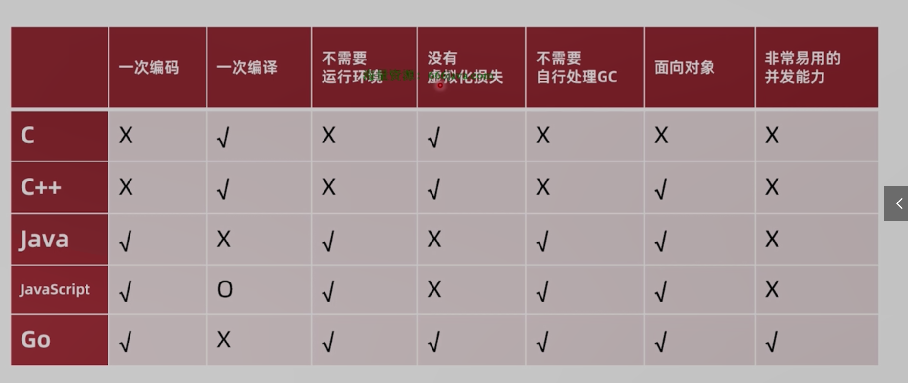

### go的特点

1.go直接编译二进制，没有虚拟化损失

2.自带运行环境，无需处理GC问题

3.一次编译可以适用多种平台

4.超强的并发支持能力与并发易用性

### go的编译过程

1.词法分析(将源代码翻译成token最小的语义结构)

2.句法分析(token序列经过处理编程语法树)

3.语义分析(类型检查 类型推断 查看类型是否匹配 逃逸分析)

4.中间码生成(为了处理不同平台的差异,先生成中间代码SSA 平台无关)

5.代码优化(每一步都可以有代码优化)

6.机械码生成(1.先生成plan9汇编代码 平台相关汇编 2.最后编译为机器码 3.输出机械码是.a文件)

7.链接(将可执行文件链接为一个可执行文件)

### go程序是如何运行的

1.go程序的入口表面是main文件实际是在 runtime中的rt0.s文件上运行的

2.读取命令行参数 复制参数数量argc和参数argv到栈上

#### 3.初始化g0执行栈(go是go程序的母协程第一个协程)

​	1.运行时检测 

​	2.调度器的初始化

#### 4.主协程(第二个人协程)执行main方法

​	1.执行runtime包的init方法

​	2.启动gc垃圾收集器

​	3.执行用户依赖的init方法

​	4.执行用户函数main.main 

