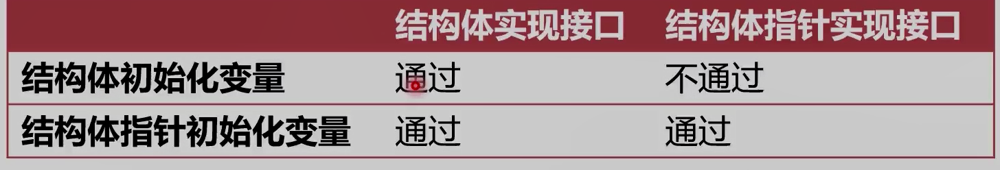

### 基本类型的字节数

#### 所有字符都是使用unicode字符集 变长

​	1.包括159种文字14万个字符

​	2.14万个字符至少需要3个字节表示

​	3.英文字符均排在前128个

​	4.utf-8 前128个只需要一个字节 西方常用字符需要两个字节 其他字符需要3个字节，极少需要4个字节

int和指针大小跟随系统字长 64为 8个字节 32位4个字节

#### 结构体 

​	1.空结构体有指针没长度(没有成员) 

​	2.所有独立出现的空结构体指针都是指向同一个地址zerobase，zerobase是所有字节长度为0的地址

##### 	3.空结构体的主要是为了节约内存

​	1.与 map结合只需要键不需要值比如hashset，

​	2.与channel结合可以当作纯信号

#### 字符串 随系统字节编号16 - 8

```go
type stringStruct struct{
    str unsafe.Pointer
    len int
}
```

​	1.底层本质是个结构体有两个成员第一个成员是指针str 第二个成员是int整型len

​	2.指针指向底层Byte数组 

​	3.需要切片时 转为rune数组切片

```
s=string([]rune(s)[:3])
```

#### 切片 随系统字节编号24-12   3*8 本质就是对数组的引用

```go
type slice struct{
    arrar unsafe.Pointer //数组的引用
    len int //切片引用部分
    cap int //切片的容量
}
```

##### 1.创建

```go
slice:=[]int{1,2,3} // 编译时插入创建数组的代码
/*先创建一个数组 再创建一个slice结构体 */
slice:=make([]int,10) //运行时创建数组
```

##### 2.追加

​	1.不扩容，只调整len(编译器负责)

​	2.扩容，编译时转为调用runtime.growslice 废弃原来的数组 创建一个新的数组引用，容量变为二倍，期望容量大于原来的两倍就会使用期望容量，切片长度大于1024，每次增加25%。切片扩容的并发不安全，要加锁。

### HashMap

#### 开放寻址法

1.写入:键hash取模后寻找数组槽(Slot)，如果被占用往后寻找空位

2.读:键hash去模后找到数组槽(Slot)，没有就往后寻找键值

#### 拉链法

1.写入：的时候如果槽(slot)被占用就在该位置后面追加一个，纵向的往后

2.读：找到槽(Slot)，遍历该位置的链表。相同hash值的key放在一起叫做hash桶(Bucket)

#### Go的map

底层是runtime包map.go文件下的hmap结构体

```go
type hmap struct{
	count        int 
    flags  		 uint8
    B 	         uint8
    noverflow    uint16
    hash0        uint 
    
    buckets      unsafe.Pointer //2^B个bmap组成的数组 每个桶最多放8个数据 同时回创建溢出桶
    oldbuckets   unsafe.Pointer// 指向原来的桶
    nevacuate    uintptr
    
    extra        *mapextra //一个桶写满了后会去寻找溢出桶
}
type bmap struct{
    topash int // 取前面八位作为可以的哈希值
    keys int  // 键
    elems int  // 值
    overflow unsafe.Pointer //溢出指针
}
//元素多于25个 先make一个空的map 再循环赋值
```

#### map的扩容 增加普通桶的数量

1.map溢出桶太多时会导致严重的性能下降

##### 2.runtime.mapassign()可能会触发扩容的情况:

​	1.装载因子超过6.5(平均每个槽6.5个key)

、2.使用了太多溢出桶(溢出桶超过了普通桶)

3.map的扩容采用渐进式，桶被操作时才会重新分配

##### 4.sync.Map使用两个map,分离了扩容问题

​	1.不会引发扩容的操作(查，改)使用read map

​	2.可能引发扩容的操作(新增)使用dirty map

### interface 接口

#### go隐式接口特点

1.只要实现接口的全部方法，就自动实现接口

2.可以再不修改代码的情况下抽象出新的接口

#### 接口的底层表示

1.接口数据使用runtime.iface表示

2.iface记录了数据的地址

3.iface 两个指针成员 一个指向函数集 一个指向值

4.eface两个指针成员 一个指向类型 一个指向值

#### 类型断言

```go
var c Car = Truck{}//接口
truck:=c.(Truck)
```

1.类型断言是一个使用再接口值上的操作

2.可以将接口值转换位其他类型值(实现或者兼容接口)

3.可以配合switch进行类型判断

```go
switch c.(type){ //c的底层是否能转换位Ttuck
	case Truck:
}
```

#### 结构体和指针实现接口



```
func(t Truck)Drive(){
	fmt.println(t.model)
}
func main(){
	var c Car = &Truck{} // go内部会实现结构体指针方法
	var c Car = Truck{} //结构体是指针方法 go内部不实现结构体方法
}
```

#### 空接口值

1.空接口可以承受所有类型的数据 runtime.eface结构体 用作任意类型的函数入参

### nil，空结构体，空接口

1.nil可以是非结构体6种类型的空值，nil有类型

2.空接口两个属性都是nil才是nil接口(指针类型，指针)

### 内存对齐

1.为了方便内存对齐，go提供了对齐系数unsafe.Aligof()

2.如果对齐系数是4，表示内存地址必须是4的倍数(第一个地址)

3.结构体既需要内部对齐,有需要外部填充对齐，空结构体作为最后一个成员，需要填充对齐
