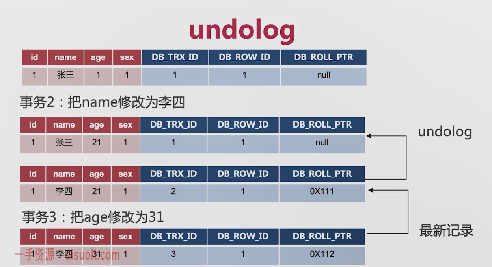

#### 事务的特性

```
ACID
A 原子性 undolog实现的
C 一致性 通过 原子性  一致性 永久性来保证的
I 隔离性 mvcc实现的
D 永久性 redolog实现的 redolog是innodb才有的 binlog是server层才有的 修改更新后innodb会将修改放入redolog设置一个状态事务commit后才会将redolog1的状态设为commit状态 
```

#### mysql有不同的隔离级别 

```
举例:开启事务A,B同时select 事务Bupdate commit后 事务A在select
可重复读 RR 事务B提交后事务A在没提交前读到的还是旧数据 默认使用可重复读
读已提交 RC 事务B提交后事务A立即就能读到数据
序列化 事务开启后只允许一个人操作 单线程
```

#### mvcc

```
多版本并发控制
并发访问数据库系统时提高读写效率，因为加锁会影响效率

mvcc分为 
当前读 总是读取最新版本的记录 update insert delete是当前读 select from update加锁也是当前读
快照读 读取历史版本的记录 select是快照读
undo log 历史版本保存在回滚日志中

```

#### undolog

```
DB_TRX_ID:创建或最后修改的记录ID 事务id
DB_ROW_ID:隐藏主键 当一条记录没有主键的时候就会默认创建一条主键
DB_ROll_PTR:回滚指针，undo log  当一条记录执行失败了需要回滚到之前的记录中，当前指针就指向上一个对应的历史记录

mysql在创建记录时回创建这几个隐藏的字段 事务id默认是1 回滚指针默认时null
事务中记录的每一次修改 id都回增加 undolog的指针就是上一次记录的地址
```

#### 数据提交的过程 两阶段提交

```
1.mysql向服务发起更新数据请求
2.服务器修改数据提交给存储引擎innodb 
3.存储引擎将修改的数据提交给内存
4.修改更新后innodb会将修改放入redolog设置一个状态
5.innodb向服务器响应数据修改成功可以提交了
6.服务器将数据写入binlog
7.服务器向innodb提交事务
8.redolog的状态设为提交
恢复数据用binlog 和 redolog比较恢复就行了
```


